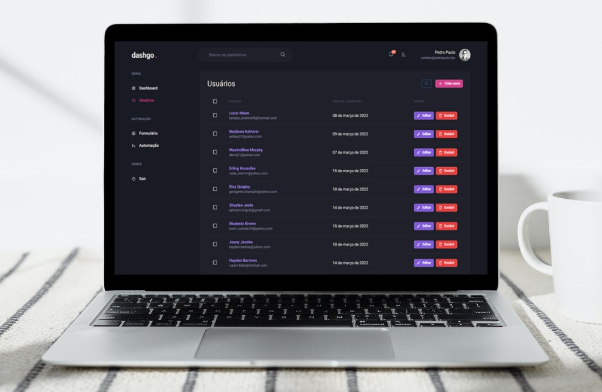

## 📊dashgo.

  

### Projeto criado no treinamento Ignite da Rocketseat

## ➡️ Sobre 
O projeto consite em utilizar o React Query para melhorar a experiência de uso da nossa aplicação já criada em outros módulos, criando uma camada de cache de dados entre o front-end e back-end.

A aplicação foi desenvolvida do zero utilizando typescript com o Chakra UI, Next.js, React-Query com Axios, React-hook-form e yup para gerir e validar alguns formulários, miragejs com faker para popular os dados do projeto.

Projeto todo responsivo, incluindo as tabelas, algo extra que implementei.

Fique à vontade para navegar no projeto! 😁

### Ver projeto online: 

## 🚀 Tecnologias 
-   [x] Next.js (api)
-   [x] Chakra UI
-   [x] Typescript
-   [x] react-query
-   [x] react-hook-form
-   [x] yup
-   [x] miragejs
-   [x] faker
-   [x] axios
-   [x] apexcharts
-   [x] react-icons
